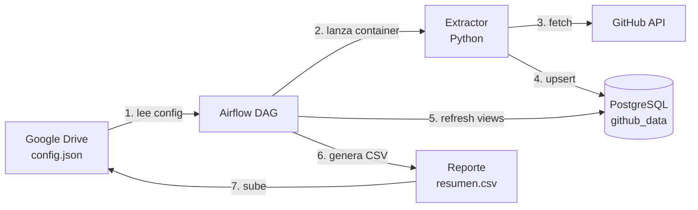

# Prueba Técnica — Data Engineer

Pipeline automatizado que extrae **issues** y **commits** desde repositorios de GitHub (públicos y privados), los carga en PostgreSQL de forma idempotente y publica un reporte resumido en Google Drive. Todo orquestado por **Apache Airflow** y empaquetado con **Docker**.

## Arquitectura



El DAG tiene **4 tareas encadenadas**:

1. **`validate_config`** — baja `config.json` de Drive y verifica que tenga repos.
2. **`run_extractor`** — extrae issues y commits de cada repo (incremental desde la última corrida) y los carga a Postgres.
3. **`refresh_views`** — refresca la vista materializada `mv_repo_summary` con conteos por repo.
4. **`generate_report`** — arma un CSV con el resumen y lo sube a Drive (reemplaza si ya existe).

## Stack

- **Python 3.12** — extractor
- **PostgreSQL 16** — almacenamiento
- **Apache Airflow 2.10** — orquestación (LocalExecutor)
- **Docker / Docker Compose** — empaquetado e infraestructura local
- **Google Drive API** — origen de configuración y destino del reporte
- **GitHub REST API** — fuente de datos

## Cómo correrlo

### 1. Clonar el repo

```bash
git clone https://github.com/AltamarDagoberto/prueba-tecnica-data-engineer.git
cd prueba-tecnica-data-engineer
```

### 2. Credenciales

Crear la carpeta `credentials/` y dejar adentro el JSON de Google Drive. Hay dos formas de autenticarse (ver sección al final):

- **Service Account** → `credentials/service_account.json`
- **OAuth user** → `credentials/oauth_token.json` (correr `python auth_oauth.py` una vez para generarlo)

### 3. Variables de entorno

```bash
cp .env.example .env
```

Editar `.env` con los valores reales (PAT de GitHub, ID de la carpeta de Drive, path absoluto del proyecto).

### 4. Subir el `config.json` a Drive

```json
{
  "repositories": [
    { "owner": "pandas-dev", "name": "pandas" },
    { "owner": "AltamarDagoberto", "name": "repo-demo-privado" }
  ]
}
```

> El `config.json` de ejemplo apunta a `AltamarDagoberto/repo-demo-privado` que es mi repo privado de prueba. Para que funcione, toca reemplazarlo por algún repo privado propio.

### 5. Construir la imagen del extractor

```bash
docker build -t github-extractor -f extractor/Dockerfile .
```

### 6. Levantar la infraestructura

```bash
docker-compose up -d
```

Servicios que se levantan:
- `postgres-data` (puerto 5432)
- `postgres-airflow`
- `airflow-init` (corre una vez y termina)
- `airflow-webserver` en http://localhost:8080
- `airflow-scheduler`

### 7. Disparar el DAG

1. Abrir http://localhost:8080
2. Login con `admin` / `admin`
3. Buscar el DAG `github_pipeline`, despausarlo y darle play

## Verificar que funcionó

### Datos en Postgres

```bash
docker exec -it postgres-data psql -U pipeline -d github_data
```

```sql
SELECT * FROM mv_repo_summary;
SELECT COUNT(*) FROM issues;
SELECT COUNT(*) FROM commits;
```

### Reporte

- Una copia queda en `reports/reporte_resumen.csv` (carpeta local del proyecto)
- Si la autenticación con Drive funciona, también se sube a la carpeta de Drive

## Detener todo

```bash
docker-compose down
```

Para borrar también los volúmenes:

```bash
docker-compose down -v
```

## Sobre la autenticación con Google Drive

Originalmente lo construí con Service Accounts, que es el patrón estándar para servidores y CI/CD. Cuando lo probé en una cuenta Gmail personal me topé con la política de Google: las Service Accounts no tienen quota propia y no pueden crear archivos en Drive de cuentas no-Workspace. Como no quería forzar al recruiter a tener Workspace para correr el demo, agregué soporte para OAuth user flow. El código auto-detecta el tipo de credencial: si le pasás un JSON de SA lo usa así, si le pasás un OAuth token también. En producción con Workspace + Shared Drives recomendaría volver a SA porque es totalmente desatendido.

## Licencia

[MIT](LICENSE)
