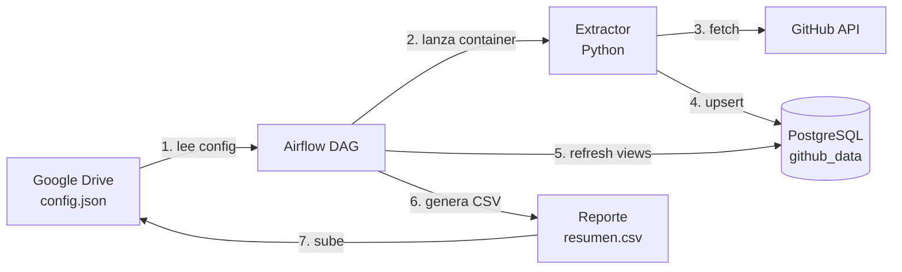

# Prueba Técnica — Data Engineer

Pipeline automatizado que extrae **issues** y **commits** desde repositorios de GitHub (públicos y privados), los carga en PostgreSQL de forma idempotente y publica un reporte resumido en Google Drive. Todo orquestado por **Apache Airflow** y empaquetado con **Docker**.

## Arquitectura

## Arquitectura

El DAG tiene **4 tareas encadenadas**...

1. **`validate_config`** — baja `config.json` de Drive y verifica que tenga repos.
2. **`run_extractor`** — extrae issues y commits de cada repo (incremental desde la última corrida) y los carga a Postgres.
3. **`refresh_views`** — refresca la vista materializada `mv_repo_summary` con conteos por repo.
4. **`generate_report`** — arma un CSV con el resumen y lo sube a Drive (reemplaza si ya existe).

## Stack

- **Python 3.12** — extractor
- **PostgreSQL 16** — almacenamiento
- **Apache Airflow 2.10** — orquestación (LocalExecutor)
- **Docker / Docker Compose** — empaquetado e infraestructura local
- **Google Drive API** — origen de configuración y destino del reporte
- **GitHub REST API** — fuente de datos

## Estructura del proyecto

El DAG tiene 4 tareas encadenadas, cada una corre en un contenedor de la imagen github-extractor:latest:

1. validate_config — baja config.json de Drive y verifica que tenga repos.
2. run_extractor — extrae issues y commits de cada repo (incremental desde la última corrida) y los carga a Postgres.
3. refresh_views — refresca la vista materializada mv_repo_summary con conteos por repo.
4. generate_report — arma un CSV con el resumen y lo sube a Drive

Python 3.12 — extractor
PostgreSQL 16 — almacenamiento
Apache Airflow 2.10 
Docker / Docker Compose — empaquetado e infraestructura local
Google Drive API — origen de configuración y destino del reporte
GitHub REST API — fuente de datos

1. Clonar el repo
git clone https://github.com/AltamarDagoberto/prueba-tecnica-data-engineer.git
cd prueba-tecnica-data-engineer
2. Poner las credenciales
Crear la carpeta credentials/ y dejar adentro el JSON de la Service Account renombrado a service_account.json:

credentials/service_account.json